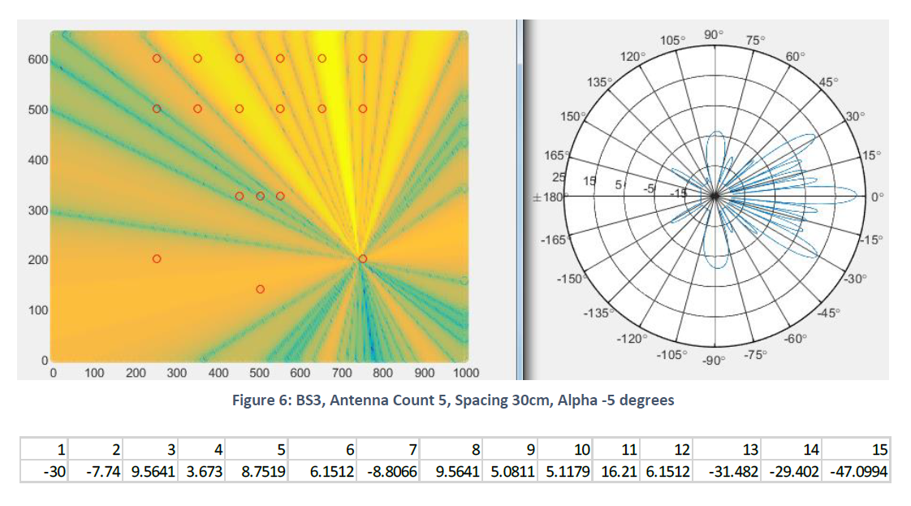

# README #

Copyright (C) 2016 Abhimanyu Nath <abhimanyu4@gmail.com>

### Wireless System Design (Final Project)

#### Problem statement 
There are 3 "cellular on wheels (COWs) portable base stations, each of which can drive a linear scan antenna array of up to 8 elements. The layout consists of 12 non-VIP spectator zones and 3 VIP spectator zones. 

***

#### Given:
- one frequency channel of 20 MHz wide, f-center = 1900 MHz
- each COW has a mast that can mount and linearly scan up to 8 antennas driven from a common downlink modulator signal. 
- each antenna has hx = 20cm and hy = 40 cm.
- overall width of the array cannot be more than 240 cm.
- each of the modulated downlink streams can be drive with power from -30 dBm to +30 dBm in 1 dB steps
- the "Boss" has promised the VIPs that they can receive from at least one downlink at all times from all 3 COWs at f-center providing service to 3 different MS's uniformly
- the "Boss" has also promised the executives that not only would 3 handsets be downlinked in every time slot but also min 24 dB SINR would always be achieved at each zone or MS

If the SINR is < 24 dBs at any zone then you lose your annual bonus. And if the SINR < 24 dB at any VIP zones, then you get fired! 

***

#### Solution
Source code and optimizations have been made as per the reasoning given in PDF. Some of the visual effects of using linear scan antenna array can be found below: 

